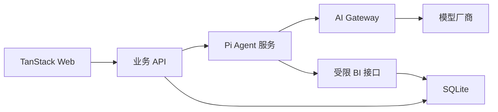

# Duoke BI Agent Demo

面向跨境电商卖家的经营分析 Agent 演示项目。卖家可以通过自然语言查询 Shopee、TikTok 等店铺的订单、销售额、退款、投诉和客服响应数据，系统以可核验的指标、图表和建议回答。

这个仓库重点演示完整系统边界，而不是单独展示一段 LLM Prompt：

- 业务后端负责用户身份、套餐积分、店铺权限、会话和历史消息；
- BI Agent 服务使用 Pi Agent Core 编排模型与受限业务工具；
- AI Gateway 隔离模型厂商差异；
- BI 查询服务在服务端强制应用权限快照；
- 前端通过流式事件展示 Agent 运行过程和结构化分析结果。

## 系统结构



## Monorepo

```text
apps/
├── web/       React + TanStack Router/Query 前端
├── api/       身份、权限、积分、会话、历史消息和 BI API
└── agent/     Pi Agent Runtime、工具编排和结构化回答
packages/
├── contracts/ 跨服务 Zod Schema 和 TypeScript 类型
└── database/  SQLite Schema、仓储和演示数据
docs/
├── requirements.md
├── architecture.md
├── technology-stack.md
└── api.md
```

## 快速开始

前置条件：Node.js `>=22.19`，npm `>=10`。

```bash
cp .env.example .env
npm install
npm run db:seed
npm run dev
```

访问：

- Web：<http://localhost:3000>
- 业务 API：<http://localhost:4000/health>
- Agent 服务：<http://localhost:4001/health>

默认使用 `AGENT_MODE=mock`，不需要模型 API Key。Mock 模式仍然走完整的前端、业务后端、Agent 服务、权限快照、BI 查询和消息持久化链路，只把 LLM 规划替换为确定性实现，便于本地验收。

建议尝试：

- `最近 30 天哪些店铺退款率最高？`
- `分析最近 30 天销售额趋势`
- `哪些店铺的客服响应时间需要关注？`
- `总结最近 30 天的经营情况`

## 使用 Pi 和 AI Gateway

将 `.env` 修改为：

```dotenv
AGENT_MODE=pi
AI_GATEWAY_BASE_URL=https://your-gateway.example.com/v1
AI_GATEWAY_API_KEY=your-key
AI_GATEWAY_MODEL=your-model-id
```

当前适配器使用 OpenAI-compatible Chat Completions 协议。Pi 负责 Agent Loop 和工具调用，模型不能直接访问 SQLite，也不能自行传入用户或店铺权限。真实模式下，模型选择 `query_business_metrics` 工具，查询结果仍由业务后端计算和授权。

## 验证

```bash
npm run typecheck
npm test
npm run build
```

## 文档

- [需求与验收标准](docs/requirements.md)
- [架构设计](docs/architecture.md)
- [技术栈与选型](docs/technology-stack.md)
- [API 与事件协议](docs/api.md)

## Demo 边界

- 使用固定演示用户 Header，不包含真实登录流程；
- SQLite 只用于本地单实例演示；
- 金额已经按 SGD 归一化，没有实现历史汇率；
- Mock 模式的建议由规则生成，不代表模型效果；
- 当前只支持概览、单维排名、销售额趋势和投诉分析；
- 归因只输出贡献关系和待验证假设，不声称因果关系；
- 没有实现生产级密钥托管、分布式限流、消息队列和高可用。

## License

[MIT](LICENSE)
