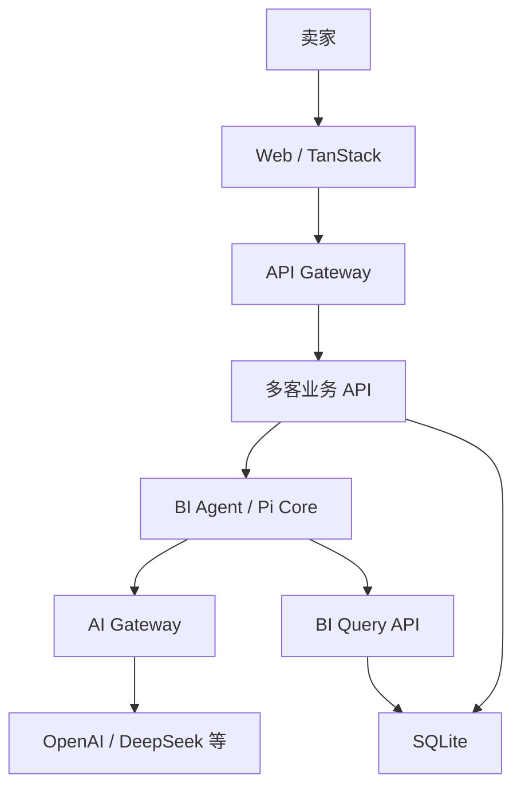
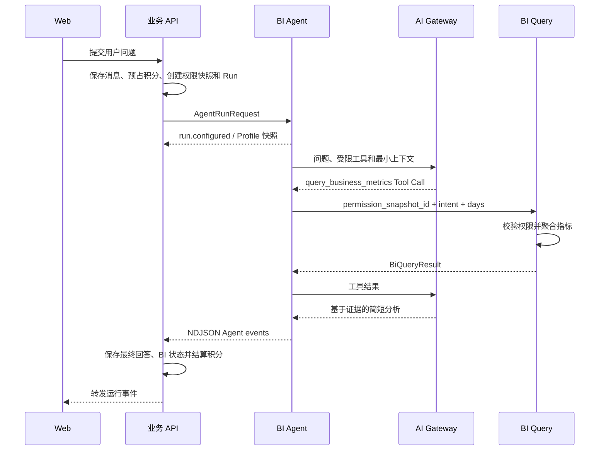
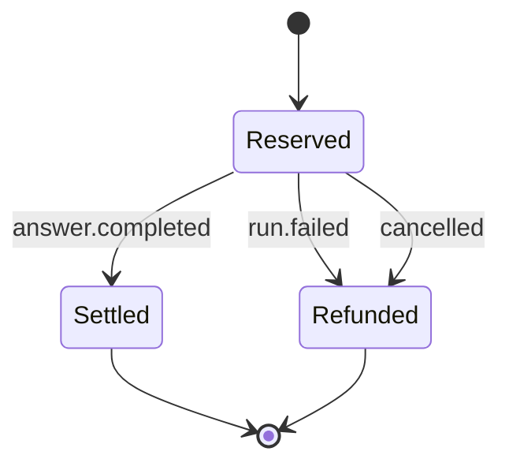

# 架构设计

## 1. 架构判断

这个系统采用单 Agent、受限工具和确定性数据服务。MVP 不引入 Sub-agent：当前问题主要是权限、指标口径和数据计算，不是多个自治角色之间的协作。

Pi 是 Agent Runtime，不是业务后端，也不是 BI 引擎。

## 2. 运行拓扑



Demo 中 API Gateway 和多客业务 API 合并在 `apps/api`，生产环境可以拆开。

## 3. 组件职责

| 组件 | 负责 | 不负责 |
|---|---|---|
| Web | 对话、流式状态、图表、历史会话 | 权限判断、指标计算 |
| 业务 API | 身份、租户、积分、权限快照、会话、消息、Run | 自然语言理解 |
| BI Agent | 上下文构造、Pi Loop、工具选择、结果解释 | 用户账户、原始 SQL、权限来源 |
| Model Profile Registry | 绑定模型、Prompt、上下文和推理参数 | 业务权限和积分规则 |
| Eval Runner | 执行版本化案例、计算确定性断言、汇总质量结果 | 修改生产 Prompt 或业务权限 |
| Eval Admin | 配置浏览、数据集浏览、运行与 Trace Review | 直接访问 Agent 内部接口 |
| AI Gateway | 模型路由、协议适配、密钥、限流、成本 | 经营数据和用户会话 |
| BI Query API | 权限校验、聚合、指标公式、查询预算 | 文本生成 |
| SQLite | Demo 业务状态和经营指标 | 生产数据仓库能力 |

## 4. 请求时序



Mock 模式省略两次模型调用，但保留其余全部边界。

模型配置通过 `ModelProfile Registry` 选择。Profile 绑定部署变量、Prompt 版本、上下文策略、推理参数和失败策略；权限与查询限制由独立 Business Policy 强制执行。详细说明见[模型配置与 Prompt 管理](model-profiles.md)。

## 5. Agent Loop

```text
识别意图
→ 选择受支持的查询类型
→ 调用 query_business_metrics
→ BI 服务应用权限快照并计算
→ 模型解释聚合结果
→ 应用端构造并验证 BiAnswer
→ answer.completed
```

工具只接收业务语义参数：

```ts
query_business_metrics({
  intent: "refund-ranking",
  days: 30
})
```

用户、租户、权限快照、币种和时区通过工具闭包及服务端上下文注入，不由模型决定。

## 6. 状态模型

系统区分四类状态：

| 状态 | 标识 | 保存位置 |
|---|---|---|
| 用户会话 | `conversation_id` | 业务数据库 |
| 单次执行 | `run_id` | 业务数据库 |
| BI 查询快照 | `dataset_id` | BI 服务；Demo 只返回 ID |
| 模型请求 | Provider Response ID | AI Gateway Trace |
| 模型配置 | `profile_id + version + config_hash` | 业务数据库 `agent_runs` |

完整历史消息和模型上下文不是同一份数据。

### 历史消息

长期保存，供用户查看、审计和恢复。

### BI Conversation State

保存指标、维度、时间、平台、店铺和前一数据集 ID，用于“再按店铺看看”等追问。

### 模型上下文

只包含最近必要消息、当前结构化状态、工具定义和经过过滤的数据结果。大数据集不写入历史 Prompt。

## 7. 权限边界

```text
authenticated user
→ user_shop_permissions
→ permission_snapshot_id（15 分钟）
→ BI Query API 再校验
→ authorized shop filter
→ aggregate result
```

模型永远看不到其他租户数据。即使模型伪造店铺 ID，BI Query API 也不接受该字段。

Demo 的 `x-demo-user-id` 只是本地替身，生产必须由 API Gateway 生成可信身份上下文。

## 8. 积分状态



预占避免流式中断导致重复扣款或透支。结算记录和余额修改在同一 SQLite 事务内完成。

## 9. 流式协议

业务 API 和 Agent 服务使用 NDJSON，每行一个完整事件：

```text
run.started
run.configured
tool.started
tool.completed
analysis.step
answer.delta
answer.completed | run.failed
```

业务 API 负责转发并拦截终止事件，以完成持久化和积分结算。前端只连接业务 API，不直接连接 Agent 服务。

`tool.*` 事件属于内部可观测数据。业务 API 会保存但不转发到卖家对话界面；Eval 管理界面通过受保护的管理 API 读取。Eval 架构见[Agent Eval 与管理控制台](evals.md)。

## 10. 失败处理

| 失败位置 | 行为 |
|---|---|
| 身份或权限 | 在调用 Agent 前拒绝 |
| 积分不足 | 不创建 Agent Run |
| Agent 不可用 | `AGENT_GATEWAY_ERROR`，退回积分 |
| BI 查询失败 | `run.failed`，退回积分 |
| 模型配置缺失 | `PI_CONFIG_MISSING` |
| 用户取消 | AbortSignal 贯穿 API、Agent、工具调用 |
| 流未正常结束 | `AGENT_STREAM_INCOMPLETE` |

## 11. 从 Demo 到生产

需要替换或增加：

- SQLite → PostgreSQL + OLAP/数据仓库；
- 单实例 `activeRuns` → Redis/任务执行器；
- Demo Header → OAuth/JWT/服务端 Session；
- 本地内部 Token → 工作负载身份和双向 TLS；
- 进程内限流 → 分布式限流与熔断；
- 固定指标 → 版本化指标语义层；
- 简单日志 → OpenTelemetry Trace 和可重复 Evals；
- 同步请求 → 可恢复的异步 Run 状态机。
