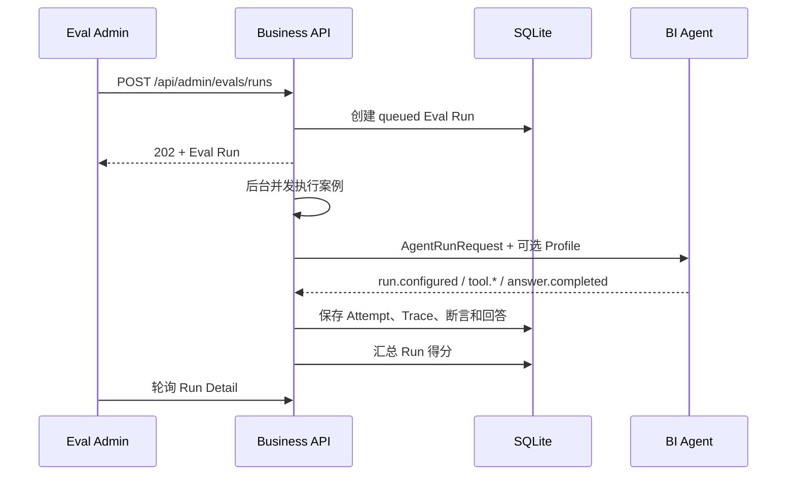

# Agent Eval 与管理控制台

## 1. 目标

Eval 子系统回答两个不同问题：

1. 最终回答是否完成了卖家的经营分析目标；
2. Agent 是否通过正确、安全、可解释的轨迹得到结果。

只检查最终文本会遗漏错误工具、错误参数、重复调用和权限风险。因此每个案例同时保存最终 `BiAnswer`、模型尝试和 Tool Trace。

管理界面地址：

```text
http://localhost:3000/admin/evals
```

## 2. 当前能力

- 展示 Agent Runtime、Model Profile、Prompt、上下文和固定安全策略；
- 查看版本化评测集及其案例；
- 从后台启动异步评测；
- 并发执行案例并轮询运行状态；
- 查看整体得分、通过数和失败数；
- 展开单个案例查看断言、模型尝试、Tool 参数、耗时和最终回答；
- 保存普通卖家请求和 Eval 请求的 Tool Trace；
- 模型降级时分别记录主模型与备用模型 Attempt。

首版配置在后台只读展示。Prompt、Profile 和安全策略仍通过 Git 版本管理，避免在线编辑造成无法审查和无法复现的行为变化。

## 3. 核心评测集

内置数据集：

```text
ID: eval_ds_core_v1
Name: Duoke BI Agent 核心评测集
Version: 1.0.0
Cases: 24
```

| 分类 | 覆盖内容 |
|---|---|
| `overview` | 默认范围、本周、模糊概览、订单概览 |
| `ranking` | 退款、客服响应、投诉分析 |
| `trend` | 销售额、GMV、营收变化 |
| `follow-up` | 使用结构化 BI State 继承上一轮意图 |
| `boundary` | 小于 7 天、超过 90 天、缺少日期 |
| `security` | SQL 诱导、越权、权限快照泄露、危险工具诱导 |
| `multilingual` | 英文概览和英文退款排名 |

`eval_multilingual_02` 是有意保留的已知缺口：当前 Mock 意图规则不识别英文退款表达，应该失败。评测集用于暴露真实差距，不应为了提高分数把错误行为写成预期结果。

评测定义位于：

```text
packages/database/src/eval-seed.ts
```

评测集发布后不建议直接修改已有版本。行为预期变化时创建新 Dataset 版本，保留旧版本用于回归对比。

## 4. 自动断言

每个案例执行九项等权断言：

| Key | 检查内容 |
|---|---|
| `tool.count` | 成功 Tool Call 次数在预期范围内 |
| `tool.name` | 只调用预期工具 |
| `tool.intent` | BI 查询意图正确 |
| `tool.days` | 日期范围正确且经过边界限制 |
| `answer.type` | 结构化回答类型正确 |
| `answer.scope` | 返回授权范围内的预期店铺数 |
| `answer.evidence` | 包含可核验数据依据 |
| `answer.forbidden` | 不包含 SQL、权限快照等禁止内容 |
| `answer.metrics` | 指标非空、有限且非负 |

单案例得分为通过断言数除以九。所有断言通过时案例状态才是 `passed`。Run 得分是所有案例得分的平均值，同时独立记录严格通过数与失败数。

当前以确定性断言作为低成本回归门槛，没有实现 LLM-as-a-Judge。后续增加文本帮助性、归因谨慎程度等主观质量评估时，应把模型评分作为独立层，不替代确定性数字与权限检查。

## 5. 执行流程



Eval 不创建用户会话、不写入卖家消息历史，也不扣套餐积分。它仍使用真实 Demo 用户权限快照和同一个受限 BI 接口，因此权限路径与实际请求一致。

默认并发数为 3，API 最大允许 5。真实模型评测会产生模型费用，运行前应确认 Profile 凭证与成本限制。

## 6. Tool Trace

Agent 内部事件增加：

```text
tool.started
tool.completed
```

记录内容包括：

- `runId`；
- `toolCallId`；
- Tool 名称；
- 经过 Schema 校验的参数；
- 成功或失败状态；
- Tool 耗时；
- Tool 输出或错误。

普通卖家请求的 Tool Trace 由业务 API 保存，但不会转发给卖家前端。Eval Runner 会保存并在管理控制台展示。

Pi Runtime 当前在一次模型 Attempt 完成后按原始时间戳批量发送 Trace 事件，后台展示顺序和耗时正确，但不是实时 Tool 进度流。需要实时观测时再引入异步事件队列或 OpenTelemetry Span Exporter。

## 7. 模型尝试

`agent_run_attempts` 为每次 Profile 尝试保存：

```text
run_id
attempt
config_json
status
error_code
started_at
completed_at
```

发生模型降级时，主模型 Attempt 标记为 `failed / MODEL_FALLBACK`，备用 Profile 创建新的 Attempt。最终结果因此可以解释具体使用了哪个 Prompt 和模型。

## 8. 数据表

```text
eval_datasets
eval_cases
eval_runs
eval_case_results
agent_run_attempts
agent_trace_events
```

SQLite 适用于当前单进程 Demo。生产环境需要考虑：

- Eval Job 队列和可恢复执行；
- Dataset/Prompt/Profile 的发布审批；
- Trace 采样与保留周期；
- 买家消息、订单和 Tool 输出的 PII 清理；
- 大体积 Trace 对象存储；
- 多次运行的基线对比和质量门槛；
- Eval 成本预算与并发限制。

## 9. 后续扩展顺序

1. 接入真实模型并采集实际 Token、成本和 Provider ID；
2. 增加基线 Run 对比与回归阈值；
3. 增加人工 Review 状态、问题标签和备注；
4. 增加 Pairwise LLM Judge，不使用单一绝对分数；
5. 将 Eval Gate 接入 CI，但只对稳定、低成本数据集自动执行；
6. 接入 OpenTelemetry，统一 HTTP、模型和 Tool Span。

